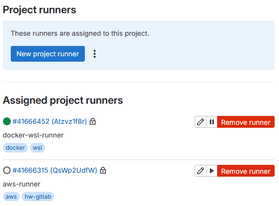
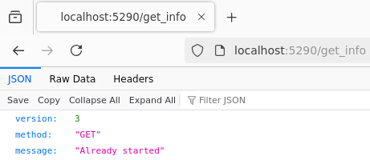
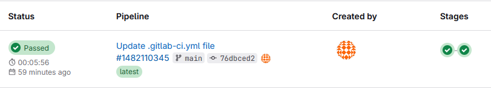
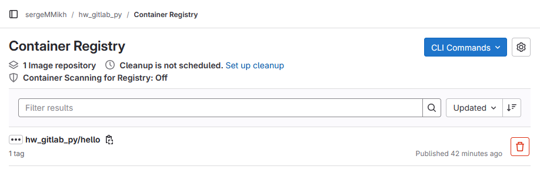
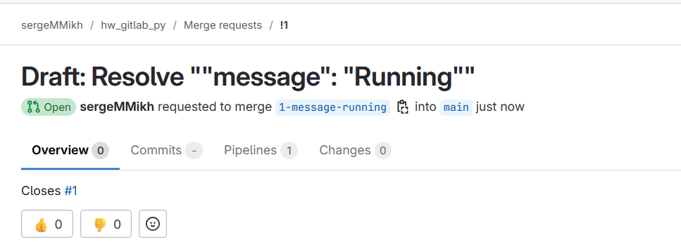
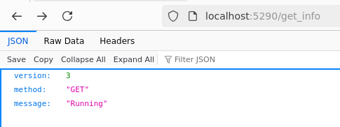
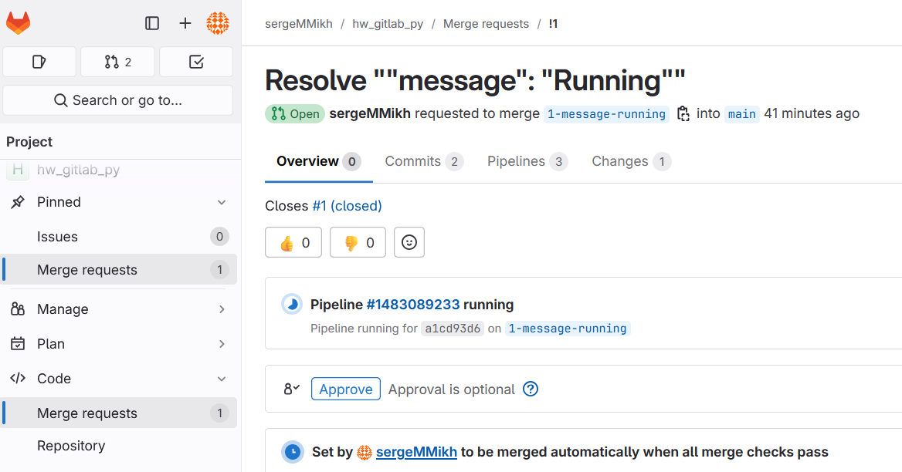
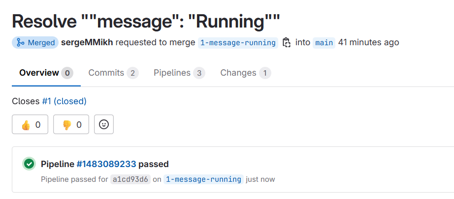
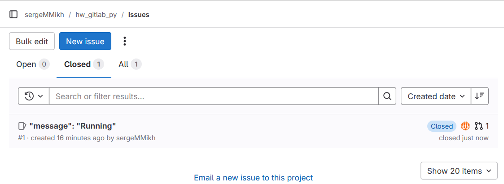

# Домашнее задание к занятию 12 «GitLab»- Михалёв Сергей

## Подготовка к выполнению

1. Или подготовьте к работе Managed GitLab от yandex cloud [по инструкции](https://cloud.yandex.ru/docs/managed-gitlab/operations/instance/instance-create) .
Или создайте виртуальную машину из публичного образа [по инструкции](https://cloud.yandex.ru/marketplace/products/yc/gitlab ) .
2. Создайте виртуальную машину и установите на нее gitlab runner, подключите к вашему серверу gitlab  [по инструкции](https://docs.gitlab.com/runner/install/linux-repository.html) .

3. (* Необязательное задание повышенной сложности. )  Если вы уже знакомы с k8s попробуйте выполнить задание, запустив gitlab server и gitlab runner в k8s  [по инструкции](https://cloud.yandex.ru/docs/tutorials/infrastructure-management/gitlab-containers). 

4. Создайте свой новый проект.
5. Создайте новый репозиторий в GitLab, наполните его [файлами](https://github.com/netology-code/mnt-homeworks/blob/MNT-video/09-ci-06-gitlab/repository/python-api.py).
6. Проект должен быть публичным, остальные настройки по желанию.

**Решение**

*Gitlab запущен на https://gitlab.com/. К проекту подключил ради тренировки два раннера: из обалака AWS и из WSL (Docker). * 
    

## Основная часть

### DevOps

В репозитории содержится код проекта на Python. Проект — RESTful API сервис. Ваша задача — автоматизировать сборку образа с выполнением python-скрипта:

1. Образ собирается на основе [centos:7](https://hub.docker.com/_/centos?tab=tags&page=1&ordering=last_updated).
2. Python версии не ниже 3.7.
3. Установлены зависимости: `flask` `flask-jsonpify` `flask-restful`.
4. Создана директория `/python_api`.
5. Скрипт из репозитория размещён в /python_api.
6. Точка вызова: запуск скрипта.
7. При комите в любую ветку должен собираться docker image с форматом имени hello:gitlab-$CI_COMMIT_SHORT_SHA . Образ должен быть выложен в Gitlab registry или yandex registry.

**Решение**

*Для сборки контейнера и запуска Flask приложения создан [Dockerfile](repository/Dockerfile). Предварительно сборка проверена на локальной машине.* 
    
*После успешного запуска предлагаемого Gitlab в Pipeline editor дефолтного pipeline отредактировал его в соответсвии с заданием.* 
*Резульатат запуска Pipeline* 
    
*Проверил наличие артефакта в Container Registryю* 
    

### Product Owner

Вашему проекту нужна бизнесовая доработка: нужно поменять JSON ответа на вызов метода GET `/rest/api/get_info`, необходимо создать Issue в котором указать:

1. Какой метод необходимо исправить.
2. Текст с `{ "message": "Already started" }` на `{ "message": "Running"}`.
3. Issue поставить label: feature.

### Developer

Пришёл новый Issue на доработку, вам нужно:

1. Создать отдельную ветку, связанную с этим Issue.
2. Внести изменения по тексту из задания.
3. Подготовить Merge Request, влить необходимые изменения в `master`, проверить, что сборка прошла успешно.

### Tester

Разработчики выполнили новый Issue, необходимо проверить валидность изменений:

1. Поднять докер-контейнер с образом `python-api:latest` и проверить возврат метода на корректность.
2. Закрыть Issue с комментарием об успешности прохождения, указав желаемый результат и фактически достигнутый.

**Решение**

*Создал Issue.* 
    
*Произвёл изменения в файле python-api.py. Проверил результат.* 
    
*Создал Merge Request.* 
    
*Закрыл Merge Request.* 
    
*Закрыл Issue.* 
    

## Итог

- файл [gitlab-ci.yml](repository/gitlab-ci.yml);
- [Dockerfile](repository/Dockerfile); 
- [лог](repository/job_log.log) успешного выполнения пайплайна;
- [решённый Issue](images/Task_3_1.png).

